# Procesverslag

## Jij

### Ontwerper:
Rosella Moens

#### Je startniveau:
Mijn startniveau is: zwart

# Je plan

  
De eerste versie/schets van je ontwerp & je persoonlijke uitdaging

  ### De eerste versie/schets:
  #### Concept 1
  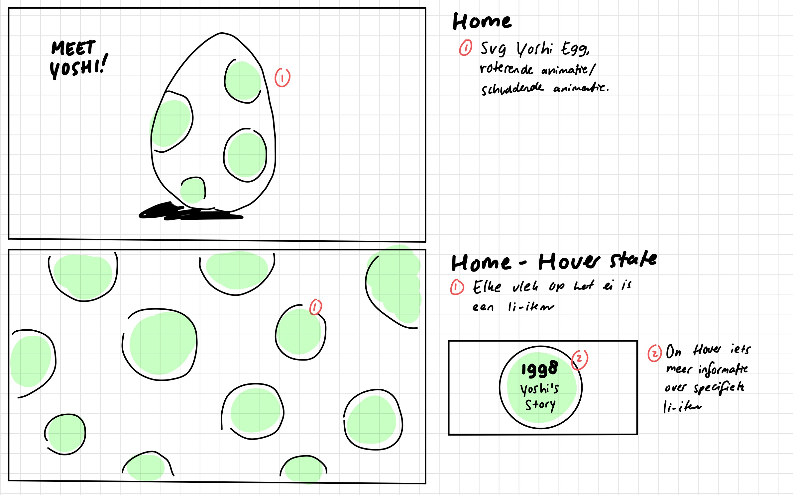 
  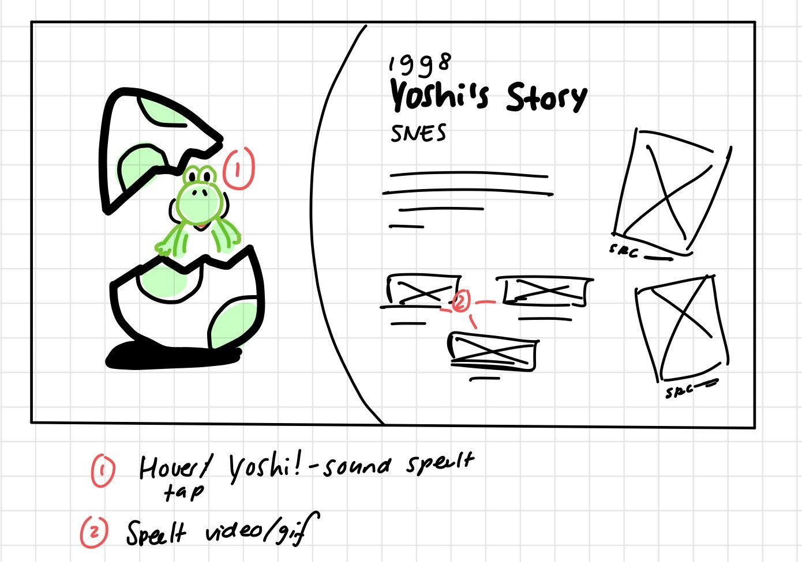

  #### Concept 2
  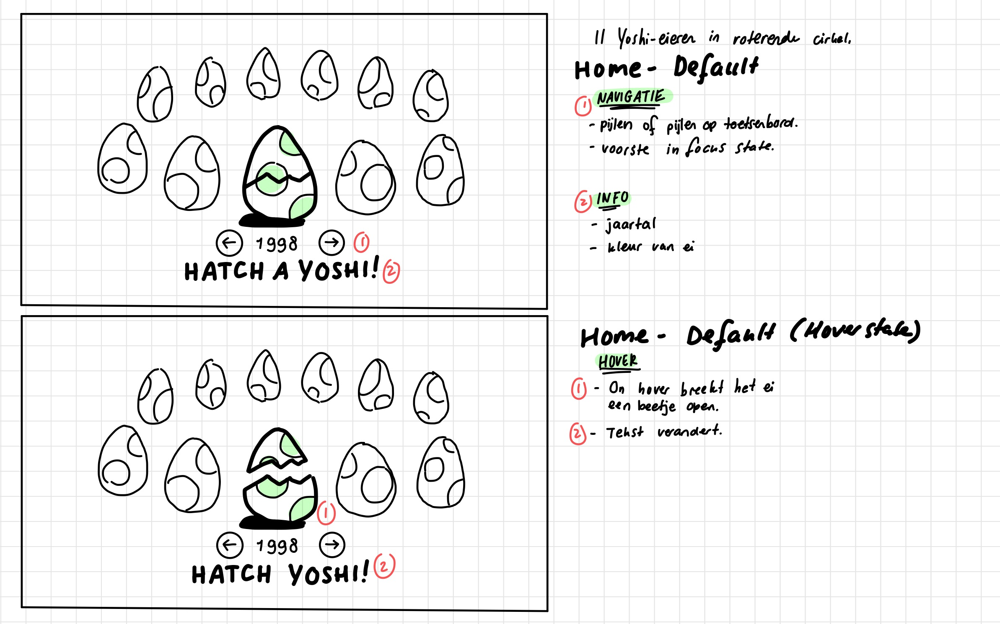 
  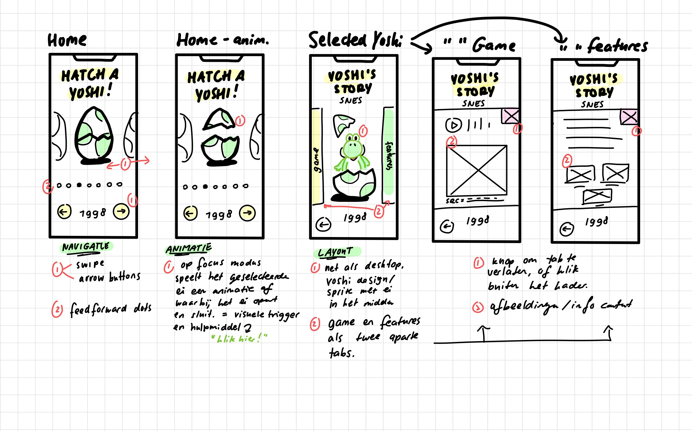 
  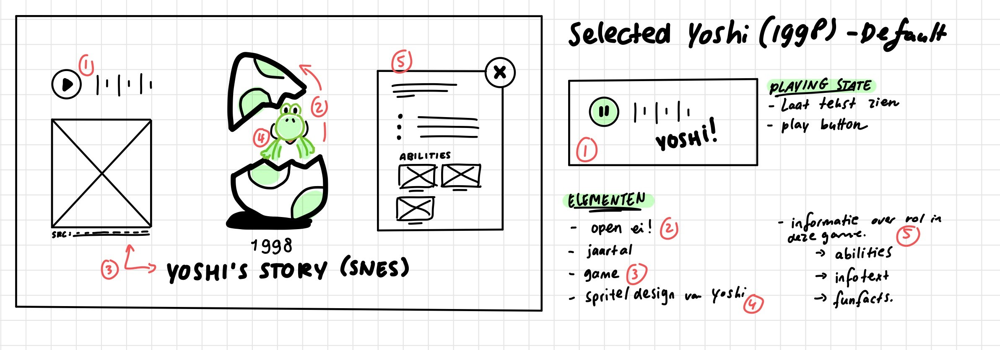 

  ### Je ambitie: 
  Aan deze technieken/punten wil ik werken:
  - Vormen en elementen maken in CSS
  - Interactie met JS
  - Drie dimensionaliteit in CSS
  - Micro animaties en micro interacties
 

## Voortgang/Feedback 1

  Feedback van: Milou (1/11) 
  Voortgang eerste paar dagen

  
Mijn bevindingen + wijzigingen 

  ### Bevinding 1:
  De layout van de elementen past nog niet echt bij het karakter en vormen van Yoshi. 

  #### Oplossing:
  Bij Yoshi denk je eerder aan ronde vormen inplaats van hoekige vormen. Denk hierbij aan zijn eigen bouw die uit rondingen bestaat en natuurlijk ook zijn iconische ei. Ik heb dit opgelost door meer schetsen te maken met een oplossing voor dit probleem: Hoe geef ik de informatie weer in ronde vormen of cirkels?

  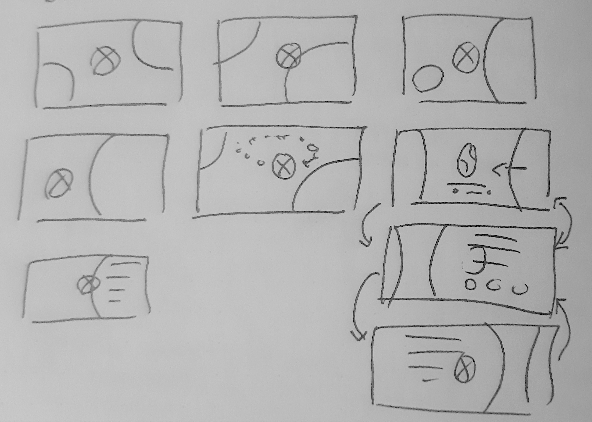

 

  ### Bevinding 2:
  Het geluid balkje is visueel niet speels en erg statisch.

  #### Oplossing:
  Het lijkt me een goed idee om een interactie toe te voegen aan Yoshi of het ei met geluiden van zijn stem uit die tijd bijvoorbeeld. Om het dynamisch en ook toegankelijk te maken had ik ook het idee om dan de tekst te laten verschijnen die Yoshi dan zegt.

  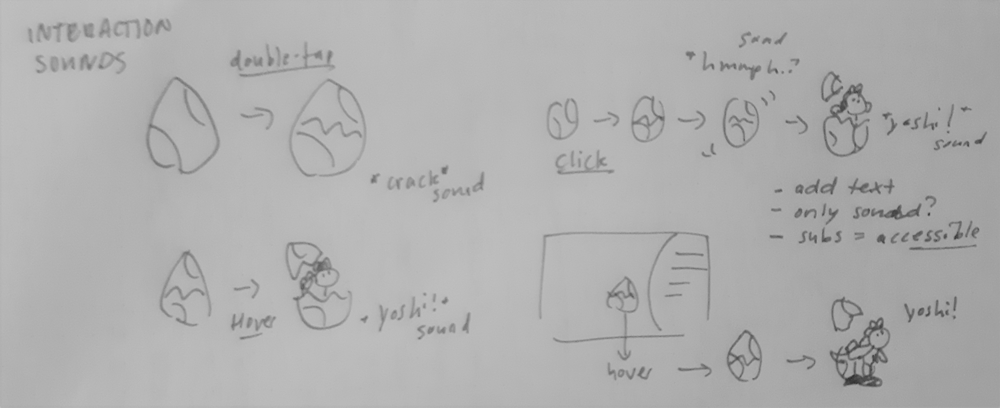

 

  ### Bevinding 3:
  Er is nog niet echt een 'easter egg' of extra toevoeging.

  #### Oplossing:
  Dit is nog iets wat ik moet onderzoeken. Ik wil graag eerst de basis en functionaliteiten hebben staan en daarna zal ik mij hier verder in verdiepen wanneer hier vrijheid van tijd beschikbaar is. In deze instantie is de gehele set-up van de JS en de carousel in CSS al een grote uitdaging.

 

  ### Bevinding 4:
  Layout van informatie in aside/section/article is nog erg statisch

  #### Oplossing:
  Voor de teksten in mijn schetsen staan grote blokken met lopende tekst. Dit is erg saai en past dus niet goed bij Yoshi's karakter. Het is zeer statisch. Om dit op te lossen heb ik in vormen van cirkels gedacht, net als bij bevinding 1. Om de lijsten in deze article ook visueel interessanter te maken, heb ik gebruik gemaakt van markers en iconen.

   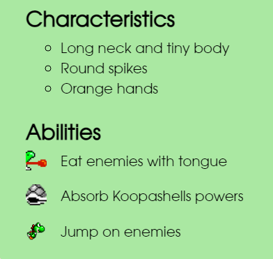

 

## Voortgang/Feedback 2

  Feedback van: Vanessa (7/11) 
  Voortgang middelpunt

  
Mijn bevindingen + wijzigingen

  
  ### Bevinding 1:
  Mijn fonts zijn dependent op een derde partij (Adobe Fonts)

  #### oplossing:
  Ik wilde het graag voorkomen dat ik een Adobe fonts link zou gebruiken voor dit project. Ik heb fonts opgezocht, die ik heb geconverteerd naar .woff en .woff2 bestanden. Deze heb ik met behulp van @font-face in de CSS toegevoegd en aangeroepen.

  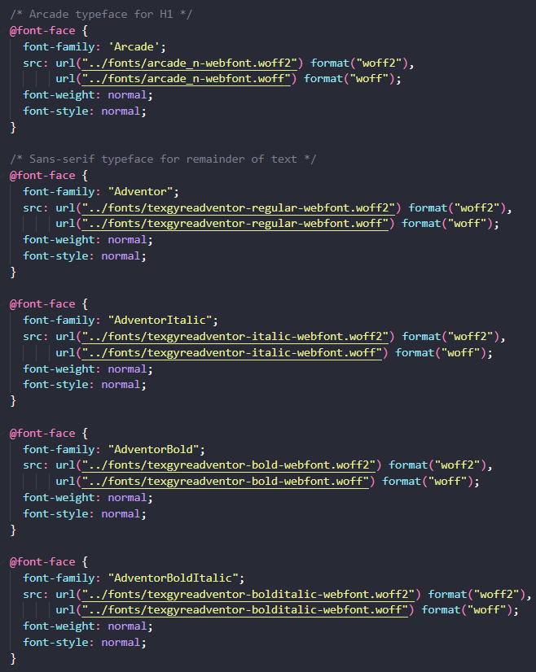

 

  ### Bevinding 2:
  Niet alle elementen kunnen nog met de tab key geselecteerd worden.

  #### oplossing:
  De eieren en twee arrow buttons zijn hiervoor geschikt, enkel is dit niet fijn bij het doortabben. Het tabben op de eieren is hierbij altijd in dezelfde volgorde (chronologisch net als in de HTML). Ook gaat de tab vervolgens naar de ul en bij alle list-items tabt hij over de kruis-buttons. Ik heb hier nog geen oplossing voor gevonden.
  Ik denk dat dit een kwestie is van de navigatie omzeilen en manipuleren.

 

  ### Bevinding 3:
  States zijn nog niet geheel en consistent toegepast op verschillende elementen.

  #### oplossing:
  De eieren en knoppen hadden nog geen states behalve de hover. Ik heb focus-visible states toegevoegd aan de eieren en buttons zowel als de hover. Deze zijn gelijk aan elkaar. Naast buttons zijn er geen andere interactieve elementen.

  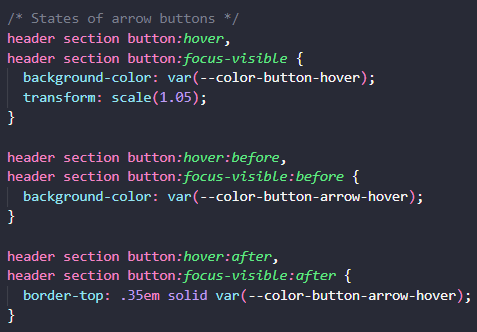
  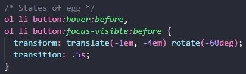

 
  
  ### Bevinding 4:
  Er mist nog geluid of een extra addition van speelsheid/easteregg

  #### oplossing:
  Ik wilde nog graag geluiden toevoegen. Ik ben op zoek gegaan naar Yoshi's stem en geluiden die hij maakt in de specifieke games van de Yoshi's uit de tijdlijn. Hier ben ik erachter gekomen dat de iconische Yoshi stem pas 8 jaar na zijn eerste game appearance voorkwam. 
  Ik heb dus gerelateerde sounds gezocht (sommigen van deze worden herbruikt in andere games, vooral de eerste paar jaren in de tijdlijn). Deze sounds staan in een array in de JS, deze worden afgespeeld wanneer de JS function showEggInformation wordt aangeroepen, wat met een click is op een ei. Met behulp van een index wordt het juiste geluid aan het juiste ei gekoppeld.

  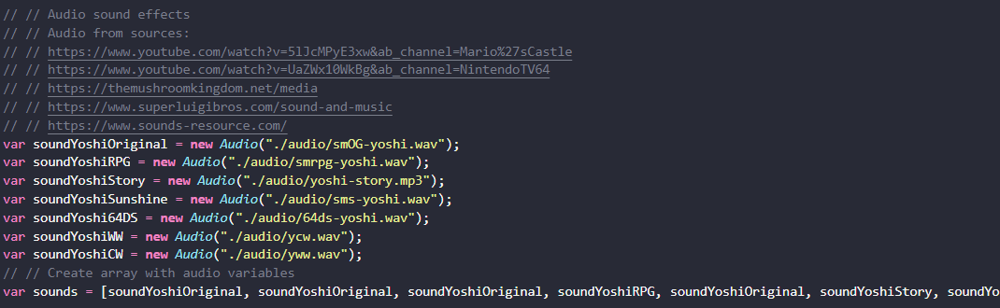
  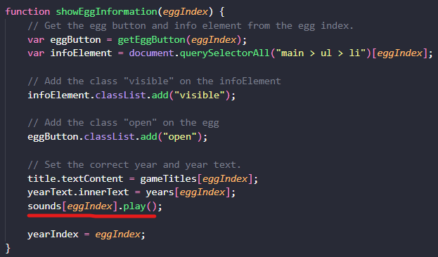

 

  ### Bevinding 5:
  Symbolen worden op mobile niet goed weergegeven. (Arrows en cross symbols)
  Bovendien ook niet op macOS.
  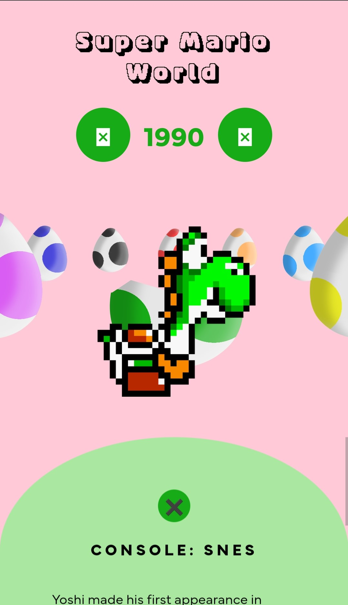

  #### oplossing:
  Om dit probleem geheel te voorkomen leek het mij geschikt om in de arrow buttons, de arrows zelf te maken met CSS pseudo elements. Met het :before pseudoelement heb ik het rechthoekige deel van de pijl gemaakt, en de :after is het driehoekige gedeelte. Deze zijn gepositioneerd met em waarden. Wanneer de button wordt geschaalt blijft de positie juist. 

  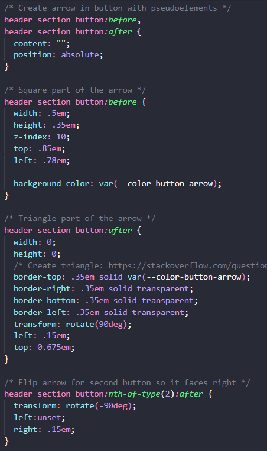
  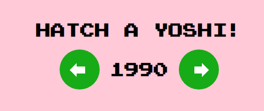

  
 

  ### Bevinding 6:
  Verhoudingen van scale Yoshi jump-1 op mobile is niet mooi.

  #### oplossing:
  Beschrijving hoe je het hebt hebt opgelost of als het niet gelukt is hoe je het zou oplossen (tekst en afbeeding(en)).

  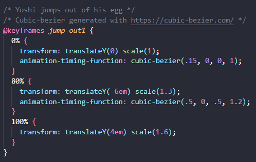
  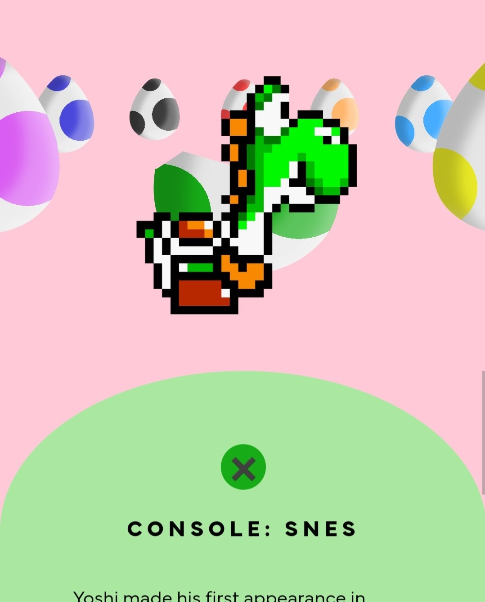

 

  ### Bevinding 7:
  De JS is een Horror oplossing (veel lines die heel makkelijk condensed kunnen worden)

  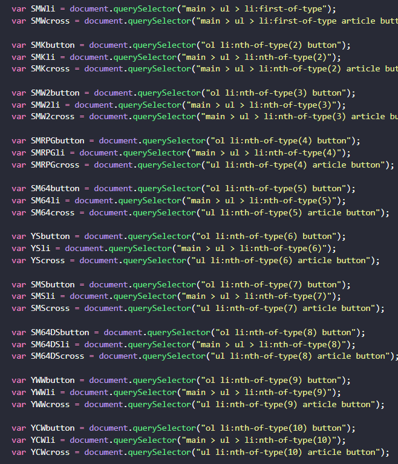
  

  #### oplossing:
  Om de functionaliteiten aan te maken en te testen op alle eieren en content die daarbij hoort, heb ik voor elk ei een button, ul li en kruisbutton geselecteerd en voor elk ei ook een specifieke functie geschreven.
  Met behulp van een for loop functie die de verschillende eieren in de ol een button, ul li en kruisbutton aanwijst. Deze wijst met eventlisteners op functies die dezelfde functionaliteiten hebben als de individuele functies van voorheen.

  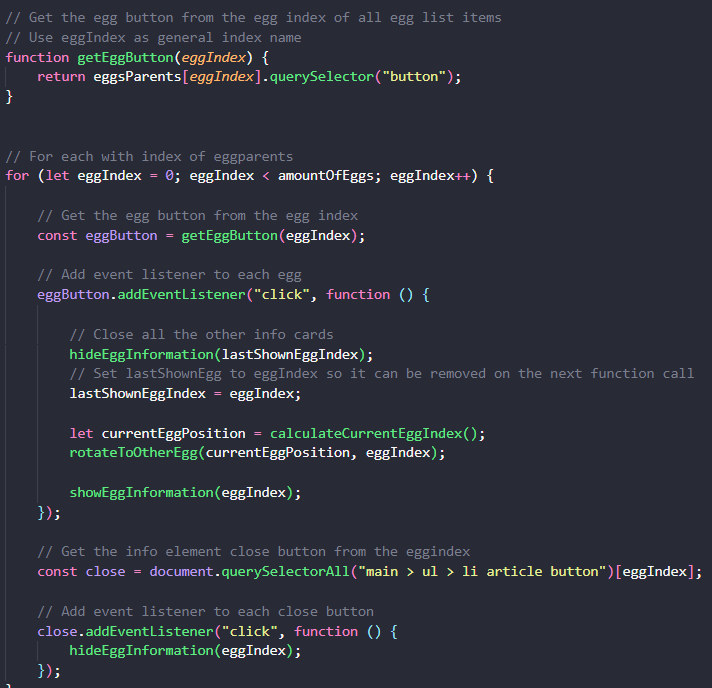
  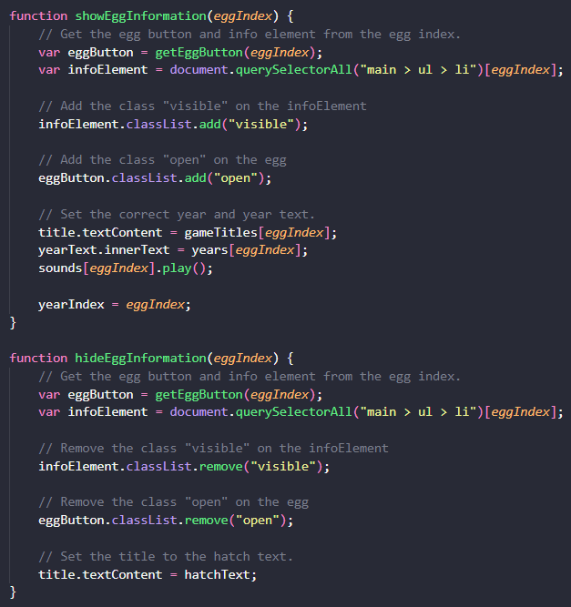

## Voortgang/Feedback 3

  Feedback van: Sandra (9/11)  
  Voortgang laatste dagen

  
Mijn bevindingen + wijzigingen

 

  ### Positionering en navigatie 
  Het is van noodzaak dat de eggCarousel efficient en mooi draait. Wanneer je op een ei klikt moet die natuurlijk vooraan het scherm verschijnen.

  #### oplossing:
  Ik heb dit opgelost met meerdere JS functies. De functionaliteiten hiervan zijn simpelweg te halen uit deze opsomming:

  * Calculate which egg we are on (1-9 either neg or pos)  
    Door uit te rekenen op welk ei we nu zijn, weten we wat de positieve of negatieve positie is van de carousel.

  * Calculate how many turns left or right it needs to turn for the target click  
    Door te berekenen hoeveel eieren de carousel moet opschuiven, kan je concluderen welk getal van de twee lager is. Het lagere getal neem je, zodat de carousel via de snelste en kortste weg zal draaien.

  * Turn the lowest amount of times   
    Draai daadwerkelijk de kortste weg na het concluderen van de laagste waarde.

  * Update the egg position  
  Plaats het ei op de juiste plek door de carousel te schuiven met (aantal eieren - kleinste weg) of (aantal eieren + kleinste weg) afhankelijk van de beweging naar links of rechts.

    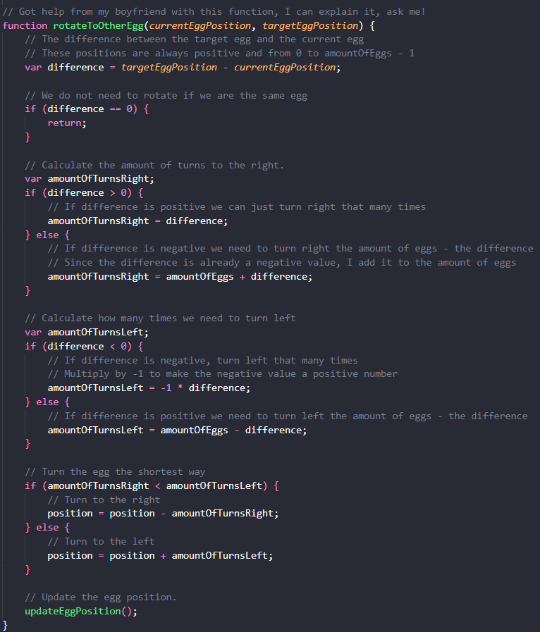
    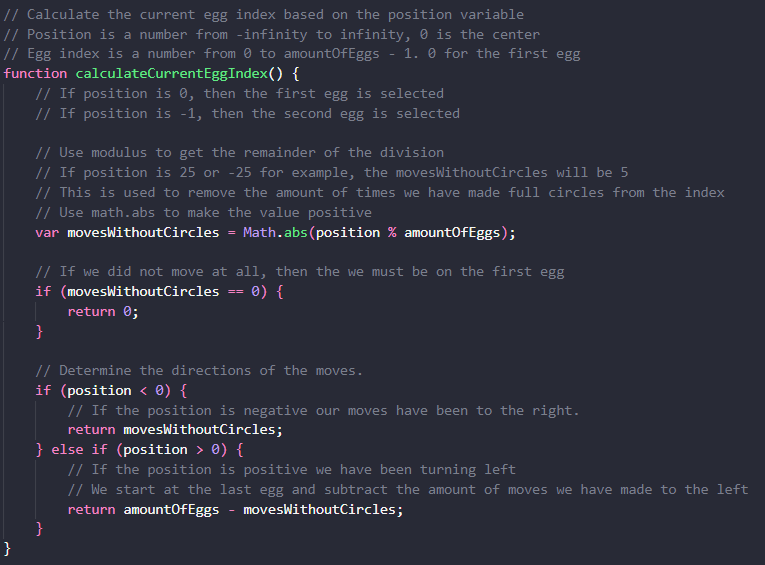
    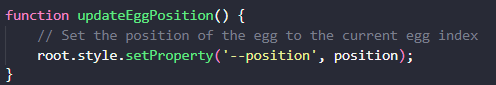

   

  ### De kleur van de achtergrond of achtergrond voelt nog kaal
  De roze kleur is niet per se gemotiveerd door Yoshi zijn karakter en voegt bovendien niet veel toe. Met een dynamischere of leukere achtergrond krijgt de website meer karakter.

  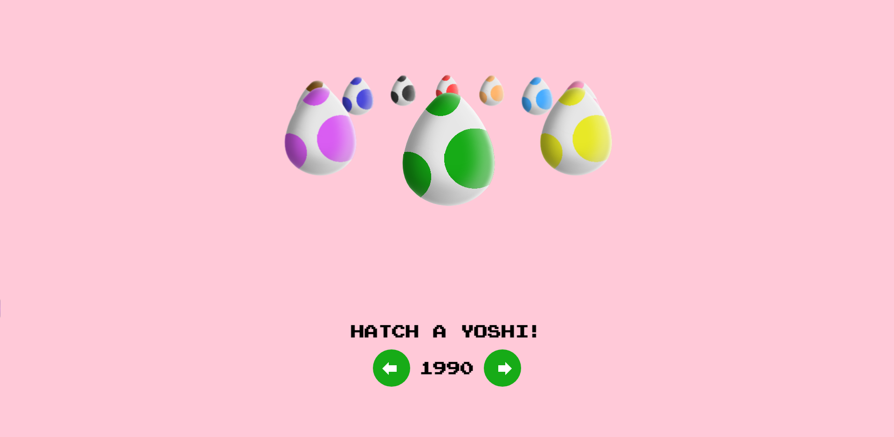

  #### oplossing:
  Ik ben op zoek gegaan naar afbeeldingen die te maken hebben met Yoshi of een soort landschap waarin Yoshi en zijn eieren kunnen staan. Hiervoor zocht ik specifiek op games waarin Yoshi een grote rol speelt, wat bij hem geassocieerd kan worden. 

  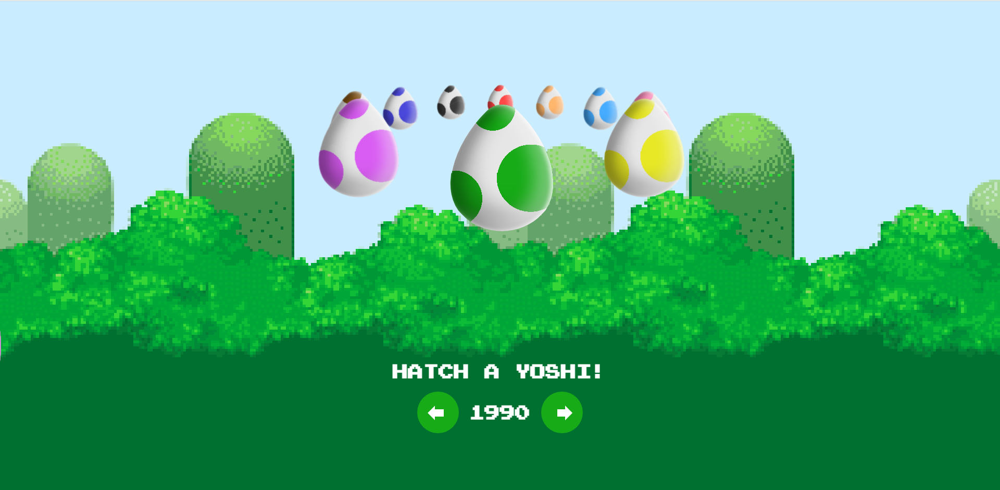 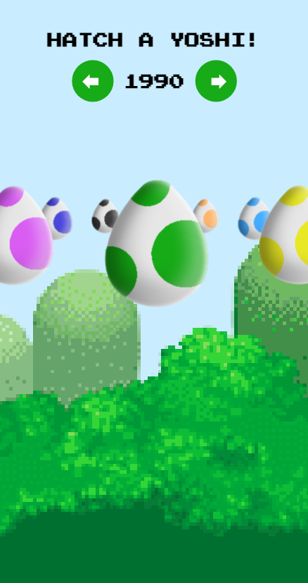 
  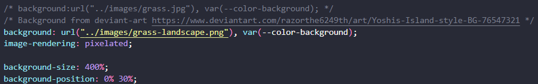

 

  ### Er mist een goede easter egg
  Ik had nog niet nagedacht over een extra gag of toevoeging van een easter egg in mijn ontwerp.

  #### oplossing:
  Tijdens het derde feedbackgesprek kwam dit ook ter sprake. Sandra noemde dat het wel noodzakelijk is en ze heeft zeker gelijk. Wat ik heel erg met Yoshi associeer, is zijn tong en hoe hij verschillende dingen kan opeten. Een leuk grapje hierbij leek me dat hij iets uit het beeld op zou eten en dat het vervolgens verdwijnt. Dit met behulp van een verborgen button.

  

 

  ### Font kan misschien in progressie van de game
  Nog een feedbackpunt voor een detail was dat het font van de titel van de game ook meer zou kunnen zeggen over het tijdperk of het spel, aangezien de huidige Arcade font niet per se past bij de huidige game-scene en huidige Yoshi.

  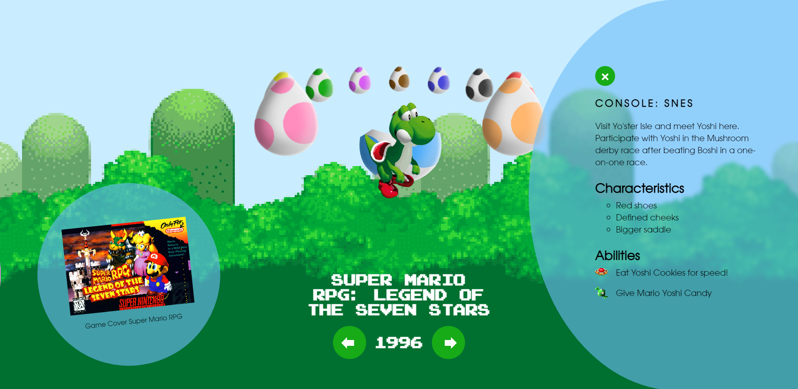  

  #### oplossing:
  Ik heb hier verder niet iets specifieks gedaan, omdat het bovendien veel tijd zou kosten om verschillende geschikte en gratis fonts te vinden en toe te passen voor alle 10 games waar de Yoshi's uit komen. Ik zou een logo of een tekst in het juiste font toevoegen om de games te representeren.

 

  ### Tab navigatie werkt niet ideaal
  De tab navigatie klikte eerst door de OL met de egg-buttons en vervolgens door de UL waarin alle info-cards staan met de kruisbuttons. Hierdoor glitchde de pagina en liet hij na het tabben door het eggCarousel alle UL info-cards zien (bovendien ook zonder animatie).

  #### oplossing:
  Ik heb om dit probleem op te lossen, gekeken naar verschillende HTML attributes: inert en tab-index. Met de inert attribute zet ik de ul li's by default op niet-selecteerbaar. Wanneer er een ei wordt aangeklikt/geopend, wordt deze attribute weggehaald met de JS show. Nu kan de gebruiker oneindig tabben door de eggCarousel maar ook wanneer hij een ei opent, de kruisbutton selecteren met de tab door de tab-index die de volgorde aanpast.

 

  ### Cursor aanpassing
  Ik wilde graag ook iets doen met de cursor wanneer je over het ei heen hovert.

  #### oplossing:
  Een andere sterke associatie die ik heb met Yoshi, is dat op Super Mario Bros. Wii hij graag appels/bessen at van de bomen. Toen ik mijn onderzoek deed naar Yoshi en zijn game-appearances heb ik geleerd dat hij van veel fruitsoorten hoort en in andere games je ook fruit kan eten met Yoshi zijn character.
  Om dit toe te passen heb ik de cursor on hover aangepast naar een appel. Het idee is, wanneer Yoshi de appel ziet, dat hij uit zijn ei wil komen. Hij neemt een kijkje uit zijn ei-schaal om deze appel beter te ruiken. Als je op hem klikt, 'voer' je hem de appel en daardoor verschijnt hij uit zijn ei.

  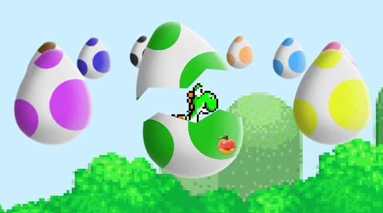

## Reflectie

  
Mijn eindresultaat & persoonlijke ontwikkeling

  ### Je uitkomst - karakteristiek screenshot(s):
  
  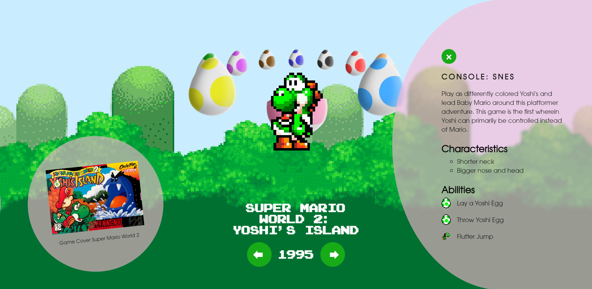

  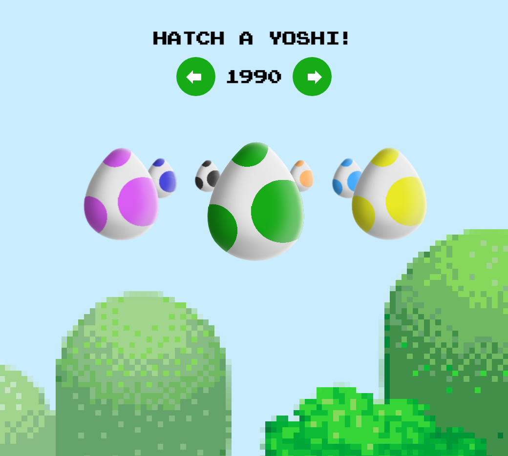
  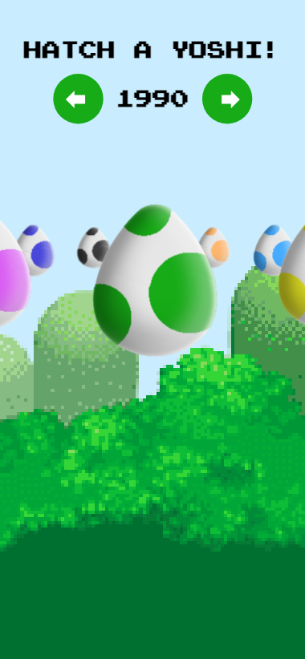

  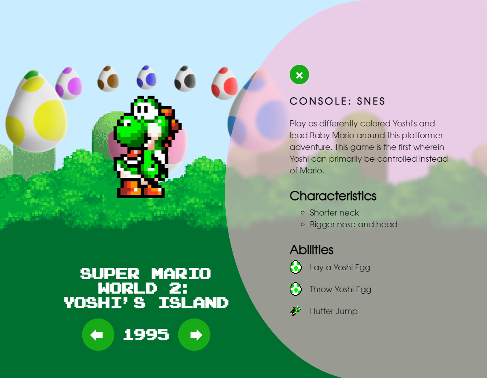
  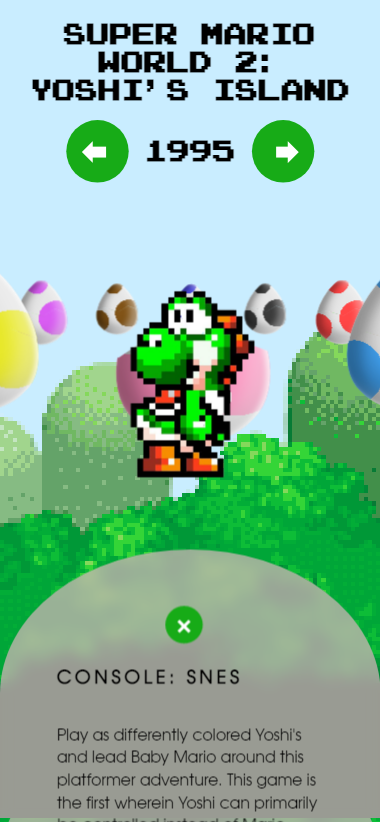

  
  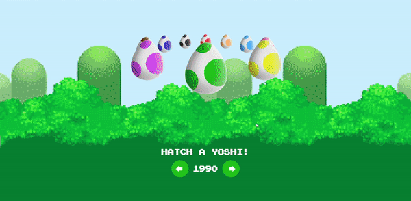

  Ik ben erg blij met mijn eindresultaat. Ik vind zelf dat het Yoshi goed karakteriseert. Ik ben tevreden met de nieuwe dingen die ik heb mogen leren tijdens dit project, zoals het maken van vormen, microinteracties en natuurlijk de ster van de show: de interactieve driedimensionale carousel.

   

  ### Dit ging goed/Heb ik geleerd: 
  #### Ging goed
  Het opstarten van de verschillende bestanden ging me goed af, dit voornamelijk omdat ik al wel ervaring en kennis heb met CSS en HTML. Het maken van de animaties vind ik erg leuk, waardoor dat ook erg motiveerd. Het helpt dat ik veel termen, properties en values al ken wanneer ik CSS schrijf.
  Ik heb ook de tijd genomen om anderen te helpen met hun CSS en/of JS in de lessen.
  * Het opzetten van de CSS en HTML
  * Animaties maken en toevoegen
  * Event listeners met JS en Classlist
  * Custom properties
   

  #### Heb ik geleerd
  * Een custom cursor toevoegen
  * Belang van Font-faces
  * Vormen maken met CSS

  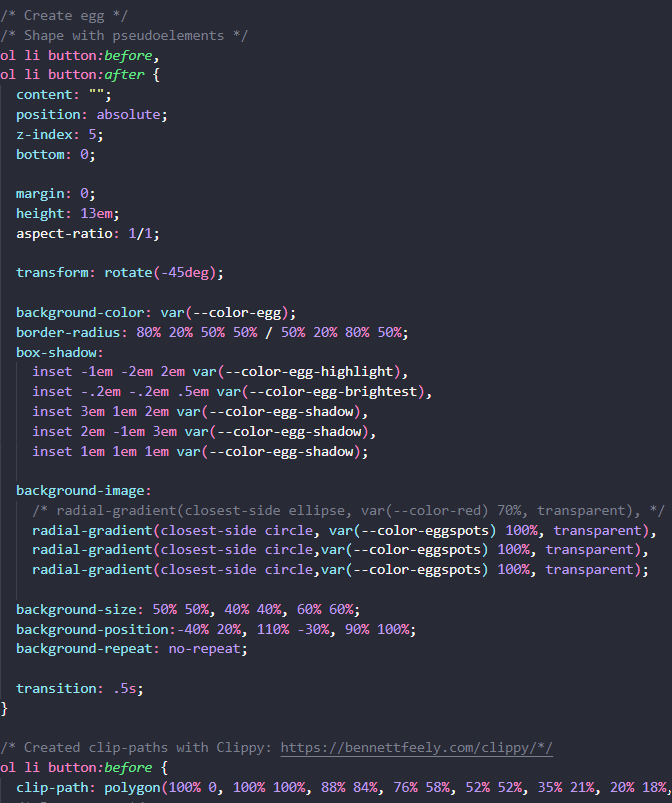

  * Een driedimensioneel carousel maken

    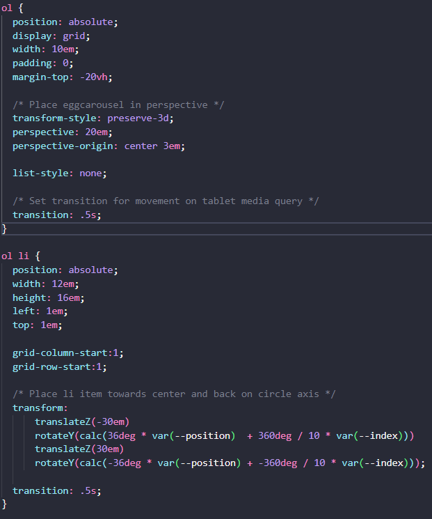
    

  * Het berekenen van de kortste weg naar een element in de carousel met JS
  * Keydown events in JS als eventlisteners

  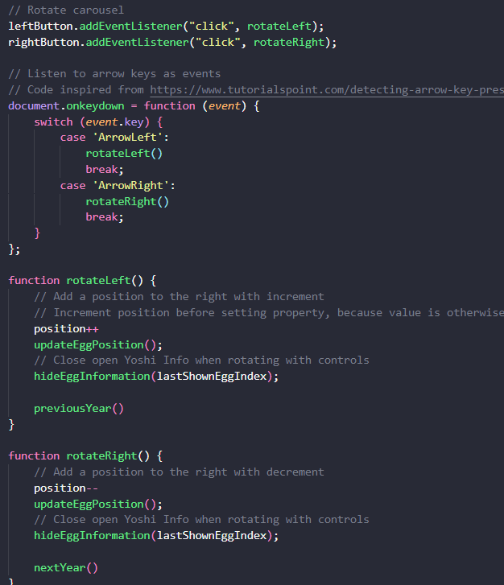

  ### Dit was lastig/Is niet gelukt:
  #### Niet gelukt:
  * 4K media query  
    Het toevoegen van een media query voor een groter scherm dan de desktop was mij niet gelukt in verband met een gebrek aan tijd. Ik zou deze nog graag willen toevoegen.
  * Fonts aanpassen (zie Feedback 3)  
    Het zoeken van fonts die geschikt zouden zijn voor deze 10 games is uitdagend, potentieel onmogelijk en tijdrovend. Hier had ik geen tijd voor. Ik ben zelf overigens wel erg blij met de uitkomst van de fonts.

  #### Dit was lastig:
  * Een driedimensioneel carousel maken  
    De dimensie en het positioneren van de eieren was een grote uitdaging. Met een beetje hulp is het mij gelukt om deze bovendien ook juist te positioneren on click met de JavaScript.

    
    

  * De ei vorm maken in CSS  
    Ik had hier moeite mee, omdat ik graag wilde dat het ei kon openen/gekraakt kon zijn, maar ik in de eerste instantie de button had gestyled als een ei.

  * Time management
    Niet specifiek aan de code of de opdracht. Het was lastig om in een korte tijd een sterk concept en goede code neer te zetten. Het was uitdagend om tijd ook na de werkgroepen efficient te gebruiken. Ik kwam vaak in de knoop in de lessen omdat ik andere mensen aan het helpen was, waardoor ik veel thuis heb moeten werken aan deze opdracht. 
    Ik heb er veel tijd in gestoken en ben blij met het eindresultaat ondanks de tijdsdruk.

## Bronnenlijst

Bronnen Code

<!-- Nb. Wees specifiek ('css-tricks' als bron is bijv. niet specifiek genoeg). -->

1. Eigen border-radius creëren Generator (9Elements Github) https://9elements.github.io/fancy-border-radius/full-control.html#70.49.71.40-73.47.75.63-.

2. Svg's in CSS (Tutorialspoint) https://www.tutorialspoint.com/How-to-draw-an-ellipse-in-HTML5-SVG

3. Svg's in CSS (CSS-tricks) https://css-tricks.com/svg-properties-and-css/

4. Ei vorm CSS (Lena Design) https://lenadesign.org/2021/03/15/css-egg-shape-and-css-easter-eggs/

5. Ei vorm CSS (Codepen van Sanne) https://codepen.io/shooft/pen/OJEMxNV

6. 3D Circular Carousel demo (3D transforms) https://3dtransforms.desandro.com/carousel

7. Clip path animaties (CSS-tricks) https://css-tricks.com/animating-with-clip-path/

8. Clippy voor custom clippath (Clippy | Bennett Feely) https://bennettfeely.com/clippy/

9. Circular Carousel met jquery (Github repo) https://github.com/sgb-io/jquery.circular-carousel

10. Transform values/properties (Mozilla) https://developer.mozilla.org/en-US/docs/Web/CSS/transform

11. 3D Circular Carousel (Codepen) https://codepen.io/claudiulazar/pen/OdvVOo

12. Grid guide (CSS-tricks) https://css-tricks.com/snippets/css/complete-guide-grid/

13. RotateY uses (Mozilla) https://developer.mozilla.org/en-US/docs/Web/CSS/transform-function/rotateY

14. Grid guide (Stackoverflow) https://stackoverflow.com/questions/18601932/css-3d-transform-perspective-grid

15. CSS variabelen aanpassen met JS (CSS-tricks) https://css-tricks.com/updating-a-css-variable-with-javascript/

16. Carousel (Codepen van Sanne) https://codepen.io/moensrc/pen/PoaNzeJ?editors=1100

17. Arrow Keys JS (Tutorialspoint) https://www.tutorialspoint.com/detecting-arrow-key-presses-in-javascript

18. Arrow Keys JS (Plain English) https://javascript.plainenglish.io/how-to-detect-arrow-key-presses-in-javascript-2c38192de0e8

19. Arrow keys keyCode Deprecated, alternative (Stackoverflow) https://stackoverflow.com/questions/35394937/keyboardevent-keycode-deprecated-what-does-this-mean-in-practice

20. Overflow hidden mobile (w3schools) https://www.w3schools.com/howto/howto_css_hide_scrollbars.asp

21. Toggle Text JS (w3schools) https://www.w3schools.com/howto/howto_js_toggle_text.asp

22. Generating Cubic bezier values (cubic-bezier) https://cubic-bezier.com/

23. Making a triangle in before for arrow (Stackoverflow) https://stackoverflow.com/questions/19010044/looking-to-use-pseudo-elements-to-create-a-triangle

24. Making a triangle in before for arrow (JS Fiddle) http://jsfiddle.net/Paulie_D/T2HuD/2/

25. Inert (Mozilla) https://developer.mozilla.org/en-US/docs/Web/API/HTMLElement/inert

26. Keydown event: Escape button (Stackoverflow) https://stackoverflow.com/questions/3369593/how-to-detect-escape-key-press-with-pure-js-or-jquery

Bronnen Text/content

1. IGN https://www.ign.com/articles/2010/05/24/yoshi-evolution-of-a-dinosaur

2. YT https://www.youtube.com/watch?v=8H_i2RQipoU&ab_channel=MikeyTheMachineGaming

3. YT https://www.youtube.com/watch?v=iGOWKHwD4s4&t=551s&ab_channel=ThomasGameDocs

4. YT https://www.youtube.com/watch?v=VRl1NDi12_k&ab_channel=XCageGame

5. Mario Wiki https://www.mariowiki.com/

