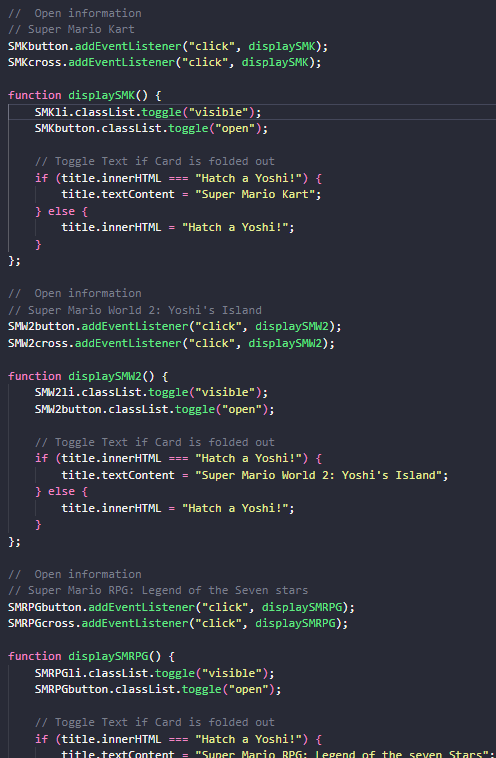

# Procesverslag
Markdown is een simpele manier om HTML te schrijven.  
Markdown cheat cheet: [Hulp bij het schrijven van Markdown](https://github.com/adam-p/markdown-here/wiki/Markdown-Cheatsheet).

Nb. De standaardstructuur en de spartaanse opmaak van de README.md zijn helemaal prima. Het gaat om de inhoud van je procesverslag. Besteedt de tijd voor pracht en praal aan je website.

Nb. Door *open* toe te voegen aan een *details* element kun je deze standaard open zetten. Fijn om dat steeds voor de relevante stuk(ken) te doen.

## Jij

### Ontwerper:
Rosella Moens

#### Je startniveau:
Mijn startniveau is: zwart

# Je plan

  
De eerste versie/schets van je ontwerp & je persoonlijke uitdaging

  ### De eerste versie/schets:
  #### Concept 1
   
  

  #### Concept 2
   
   
   

  ### Je ambitie: 
  Aan deze technieken/punten wil ik werken:
  - Vormen en elementen maken in CSS
  - Interactie met JS
  - Drie dimensionaliteit in CSS
  - Micro animaties en micro interacties
 

## Voortgang/Feedback 1

  
Mijn bevindingen + wijzigingen 

  ### Bevinding 1:
  De layout van de elementen past nog niet echt bij het karakter en vormen van Yoshi. 

  #### Oplossing:
  Bij Yoshi denk je eerder aan ronde vormen inplaats van hoekige vormen. Denk hierbij aan zijn eigen bouw die uit rondingen bestaat en natuurlijk ook zijn iconische ei. Ik heb dit opgelost door meer schetsen te maken met een oplossing voor dit probleem: Hoe geef ik de informatie weer in ronde vormen of cirkels?

  

 

  ### Bevinding 2:
  Het geluid balkje is visueel niet speels en erg statisch.

  #### Oplossing:
  Het lijkt me een goed idee om een interactie toe te voegen aan Yoshi of het ei met geluiden van zijn stem uit die tijd bijvoorbeeld. Om het dynamisch en ook toegankelijk te maken had ik ook het idee om dan de tekst te laten verschijnen die Yoshi dan zegt.

  

 

  ### Bevinding 3:
  Er is nog niet echt een 'easter egg' of extra toevoeging.

  #### Oplossing:
  Dit is nog iets wat ik moet onderzoeken. Ik wil graag eerst de basis en functionaliteiten hebben staan en daarna zal ik mij hier verder in verdiepen wanneer hier vrijheid van tijd beschikbaar is. In deze instantie is de gehele set-up van de JS en de carousel in CSS al een grote uitdaging.

 

  ### Bevinding 4:
  Layout van informatie in aside/section/article is nog erg statisch

  #### Oplossing:
  Voor de teksten in mijn schetsen staan grote blokken met lopende tekst. Dit is erg saai en past dus niet goed bij Yoshi's karakter. Het is zeer statisch. Om dit op te lossen heb ik in vormen van cirkels gedacht, net als bij bevinding 1. Om de lijsten in deze article ook visueel interessanter te maken, heb ik gebruik gemaakt van markers en iconen.

   

 

## Voortgang/Feedback 2

  
Mijn bevindingen + wijzigingen

  
  ### Bevinding 1:
  Mijn fonts zijn dependent op een derde partij (Adobe Fonts)

  #### oplossing:
  Ik wilde het graag voorkomen dat ik een Adobe fonts link zou gebruiken voor dit project. Ik heb fonts opgezocht, die ik heb geconverteerd naar .woff en .woff2 bestanden. Deze heb ik met behulp van @font-face in de CSS toegevoegd en aangeroepen.

  

 

  ### Bevinding 2:
  Niet alle elementen kunnen nog met de tab key geselecteerd worden.

  #### oplossing:
  De eieren en twee arrow buttons zijn hiervoor geschikt, enkel is dit niet fijn bij het doortabben. Het tabben op de eieren is hierbij altijd in dezelfde volgorde (chronologisch net als in de HTML). Ook gaat de tab vervolgens naar de ul en bij alle list-items tabt hij over de kruis-buttons. Ik heb hier nog geen oplossing voor gevonden.
  Ik denk dat dit een kwestie is van de navigatie omzeilen en manipuleren.

 

  ### Bevinding 3:
  States zijn nog niet geheel en consistent toegepast op verschillende elementen.

  #### oplossing:
  De eieren en knoppen hadden nog geen states behalve de hover. Ik heb focus-visible states toegevoegd aan de eieren en buttons zowel als de hover. Deze zijn gelijk aan elkaar. Naast buttons zijn er geen andere interactieve elementen.

  
  

 
  
  ### Bevinding 4:
  Er mist nog geluid of een extra addition van speelsheid/easteregg

  #### oplossing:
  Ik wilde nog graag geluiden toevoegen. Ik ben op zoek gegaan naar Yoshi's stem en geluiden die hij maakt in de specifieke games van de Yoshi's uit de tijdlijn. Hier ben ik erachter gekomen dat de iconische Yoshi stem pas 8 jaar na zijn eerste game appearance voorkwam. 
  Ik heb dus gerelateerde sounds gezocht (sommigen van deze worden herbruikt in andere games, vooral de eerste paar jaren in de tijdlijn). Deze sounds staan in een array in de JS, deze worden afgespeeld wanneer de JS function showEggInformation wordt aangeroepen, wat met een click is op een ei. Met behulp van een index wordt het juiste geluid aan het juiste ei gekoppeld.

  
  

 

  ### Bevinding 5:
  Symbolen worden op mobile niet goed weergegeven. (Arrows en cross symbols)
  Bovendien ook niet op macOS.
  

  #### oplossing:
  Om dit probleem geheel te voorkomen leek het mij geschikt om in de arrow buttons, de arrows zelf te maken met CSS pseudo elements. Met het :before pseudoelement heb ik het rechthoekige deel van de pijl gemaakt, en de :after is het driehoekige gedeelte. Deze zijn gepositioneerd met em waarden. Wanneer de button wordt geschaalt blijft de positie juist. 

  
  

  
 

  ### Bevinding 6:
  Verhoudingen van scale Yoshi jump-1 op mobile is niet mooi.

  #### oplossing:
  Beschrijving hoe je het hebt hebt opgelost of als het niet gelukt is hoe je het zou oplossen (tekst en afbeeding(en)).

  
  

 

  ### Bevinding 7:
  De JS is een Horror oplossing (veel lines die heel makkelijk condensed kunnen worden)

  
  

  #### oplossing:
  Om de functionaliteiten aan te maken en te testen op alle eieren en content die daarbij hoort, heb ik voor elk ei een button, ul li en kruisbutton geselecteerd en voor elk ei ook een specifieke functie geschreven.
  Met behulp van een for loop functie die de verschillende eieren in de ol een button, ul li en kruisbutton aanwijst. Deze wijst met eventlisteners op functies die dezelfde functionaliteiten hebben als de individuele functies van voorheen.

  
  

  * Assign each egg a button, li and crossbutton
  * Calculate which egg we are on (1-9 either neg or pos)
  * Calculate how many turns left or right it needs to turn for the target click
  * Turn the lowest amount of times
  * Update the egg position

## Voortgang/Feedback 3

  
Mijn bevindingen + wijzigingen

  
  ### De kleur van de achtergrond of achtergrond voelt nog kaal
  Omschrijving van wat er nog niet orde was (tekst en afbeeding(en)).

  #### oplossing:
  Beschrijving hoe je het hebt hebt opgelost of als het niet gelukt is hoe je het zou oplossen (tekst en afbeeding(en)).

 

  ### Er mist een goede easter egg
  Omschrijving van wat er nog niet orde was (tekst en afbeeding(en)).

  #### oplossing:
  Beschrijving hoe je het hebt hebt opgelost of als het niet gelukt is hoe je het zou oplossen (tekst en afbeeding(en)).

 

  ### Font kan misschien in progressie van de game
  Omschrijving van wat er nog niet orde was (tekst en afbeeding(en)).

  #### oplossing:
  Beschrijving hoe je het hebt hebt opgelost of als het niet gelukt is hoe je het zou oplossen (tekst en afbeeding(en)).

 

  ### Tab navigatie werkt niet ideaal
  Omschrijving van wat er nog niet orde was (tekst en afbeeding(en)).

  #### oplossing:
  Inert en Tab-index

 

  ### 
  Omschrijving van wat er nog niet orde was (tekst en afbeeding(en)).

  #### oplossing:
  Beschrijving hoe je het hebt hebt opgelost of als het niet gelukt is hoe je het zou oplossen (tekst en afbeeding(en)).

## Reflectie

  
Mijn eindresultaat & persoonlijke ontwikkeling

  ### Je uitkomst - karakteristiek screenshot(s):
  

  ### Dit ging goed/Heb ik geleerd: 
  Korte omschrijving met plaatje(s)

  

  ### Dit was lastig/Is niet gelukt:
  Korte omschrijving met plaatje(s)

  

## Bronnenlijst

Bronnen

<!-- Nb. Wees specifiek ('css-tricks' als bron is bijv. niet specifiek genoeg). -->

1. Eigen border-radius creëren Generator (9Elements Github) https://9elements.github.io/fancy-border-radius/full-control.html#70.49.71.40-73.47.75.63-.

2. Svg's in CSS (Tutorialspoint) https://www.tutorialspoint.com/How-to-draw-an-ellipse-in-HTML5-SVG

3. Svg's in CSS (CSS-tricks) https://css-tricks.com/svg-properties-and-css/

4. Ei vorm CSS (Lena Design) https://lenadesign.org/2021/03/15/css-egg-shape-and-css-easter-eggs/

5. Ei vorm CSS (Codepen van Sanne) https://codepen.io/shooft/pen/OJEMxNV

6. 3D Circular Carousel demo (3D transforms) https://3dtransforms.desandro.com/carousel

7. Clip path animaties (CSS-tricks) https://css-tricks.com/animating-with-clip-path/

8. Clippy voor custom clippath (Clippy | Bennett Feely) https://bennettfeely.com/clippy/

9. Circular Carousel met jquery (Github repo) https://github.com/sgb-io/jquery.circular-carousel

10. Transform values/properties (Mozilla) https://developer.mozilla.org/en-US/docs/Web/CSS/transform

11. 3D Circular Carousel (Codepen) https://codepen.io/claudiulazar/pen/OdvVOo

12. Grid guide (CSS-tricks) https://css-tricks.com/snippets/css/complete-guide-grid/

13. RotateY uses (Mozilla) https://developer.mozilla.org/en-US/docs/Web/CSS/transform-function/rotateY

14. Grid guide (Stackoverflow) https://stackoverflow.com/questions/18601932/css-3d-transform-perspective-grid

15. CSS variabelen aanpassen met JS (CSS-tricks) https://css-tricks.com/updating-a-css-variable-with-javascript/

16. Carousel (Codepen van Sanne) https://codepen.io/moensrc/pen/PoaNzeJ?editors=1100

17. Arrow Keys JS (Tutorialspoint) https://www.tutorialspoint.com/detecting-arrow-key-presses-in-javascript

18. Arrow Keys JS (Plain English) https://javascript.plainenglish.io/how-to-detect-arrow-key-presses-in-javascript-2c38192de0e8

19. Arrow keys keyCode Deprecated, alternative (Stackoverflow) https://stackoverflow.com/questions/35394937/keyboardevent-keycode-deprecated-what-does-this-mean-in-practice

20. Overflow hidden mobile (w3schools) https://www.w3schools.com/howto/howto_css_hide_scrollbars.asp

21. Toggle Text JS (w3schools) https://www.w3schools.com/howto/howto_js_toggle_text.asp

22. Generating Cubic bezier values (cubic-bezier) https://cubic-bezier.com/

23. Making a triangle in before for arrow (Stackoverflow) https://stackoverflow.com/questions/19010044/looking-to-use-pseudo-elements-to-create-a-triangle

24. 

25.

